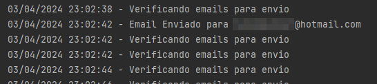
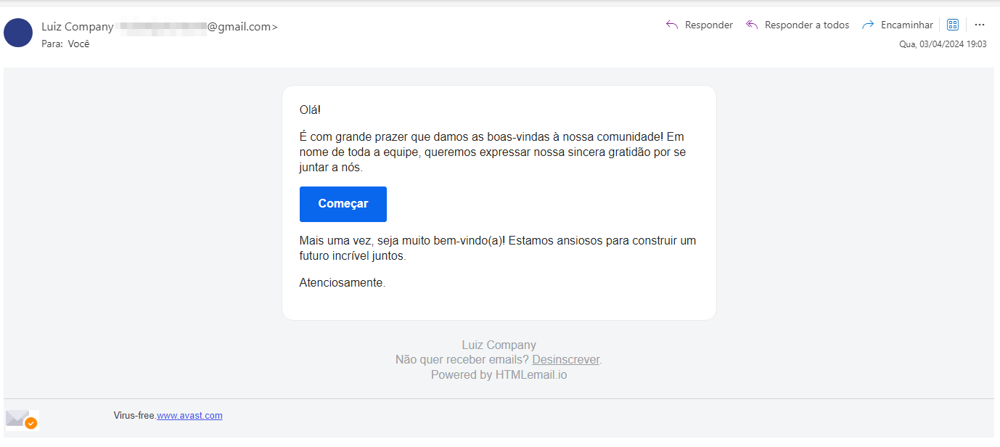

# Uma API simples de email que consome o SMTP do google utilizando Java mail sender.

## Tecnologias Utilizadas

- 
- 

## Funcionamento

- Backend:
  - Basta cadastrar suas credenciais do serviço de SMTP do Google na tabela -> user_credentials.
  - Fazer uma requisição para o endpoint -> http://localhost:8080/emails/enviar com o corpo da requisição abaixo:
    ```json
    {
      "destinatario": "teste@hotmail.com",
      "corpoEmail": "teste",
      "assunto": "teste"
    }
    ```
  - Basta configurar via codigo se deseja enviar uma mensagem simples ou com HTML.
  - Um Job roda a cada 2 segundos captura as mensagems e faz o envio.

## Como Executar o Projeto

1. **Backend (SpringBoot3)**:
   - Clone este repositório.
   - Importe o projeto em sua IDE favorita.
   - Execute a aplicação Spring Boot.

## Job Capturando os emails pendentes


## Email entregue

